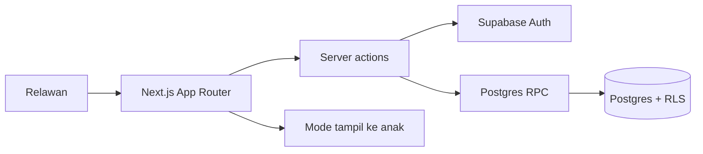

# Arsitektur

- Auth memakai cookie Supabase SSR yang diperbarui oleh `proxy.ts`. Semua halaman privat memeriksa `getUser()` dan keanggotaan.
- Pembuatan sesi, simpan jawaban, dan finalisasi memakai RPC database dengan konteks JWT pengguna. RLS tetap membatasi baca serta tabel lain.
- Instrumen versi `tangga-angka-v1` tersimpan sebagai level dan soal di database. RPC menyalin snapshot ke sesi. Revisi instrumen berikutnya harus berupa versi baru.
- `revision` mencegah tulis bersamaan. `idempotency_key` mencegah duplikasi sesi. Finalisasi mengunci row dan mengembalikan sesi selesai pada retry.
- Komponen layar asesmen menerima snapshot server, lalu menahan antrean sementara hanya dalam memori. Pilihan ini membatasi residu data privat di perangkat bersama, dengan konsekuensi tab harus tetap terbuka saat offline.
- Server action memvalidasi input melalui Zod; RPC memvalidasi ulang status, soal, akses peserta, dan revisi.

Keputusan berikutnya: bila penggunaan offline penuh diperlukan, rancang penyimpanan lokal terenkripsi dengan masa hidup singkat, migrasi key aman, dan prosedur penghapusan perangkat. Implementasi sekarang mendukung koneksi putus sesaat selama tab tetap terbuka.

## Kuis publik

`/quiz/[slug]` mengambil pertanyaan tanpa kunci jawaban melalui server. Aksi publik memvalidasi nama lengkap, umur angka, pilihan, dan kunci idempotensi; database menghitung skor dalam `submit_public_quiz`. Tabel kiriman tidak memberikan hak baca kepada pengunjung anonim. Link dibuat dan dapat ditutup admin. Hasil kuis mandiri disimpan terpisah dari sesi relawan karena soalnya telah diadaptasi untuk diisi sendiri. Admin dapat menautkan kiriman ke peserta secara manual; pencocokan nama otomatis tidak digunakan.
