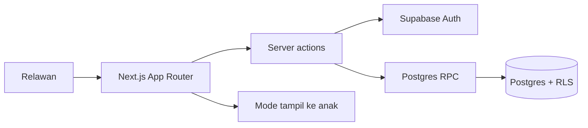

# Arsitektur

- Auth memakai cookie Supabase SSR yang diperbarui oleh `proxy.ts`. Halaman privat memeriksa klaim JWT terverifikasi melalui `getClaims()` dan keanggotaan. Jalur kuis publik tidak melakukan panggilan Auth.
- Pembuatan sesi, simpan jawaban, dan finalisasi memakai RPC database dengan konteks JWT pengguna. RLS tetap membatasi baca serta tabel lain.
- Instrumen versi `tangga-angka-v1` tersimpan sebagai level dan soal di database. RPC menyalin snapshot ke sesi. Revisi instrumen berikutnya harus berupa versi baru.
- `revision` mencegah tulis bersamaan. `idempotency_key` mencegah duplikasi sesi. Finalisasi mengunci row dan mengembalikan sesi selesai pada retry.
- Komponen layar asesmen menerima snapshot server, lalu menahan antrean sementara hanya dalam memori. Pilihan ini membatasi residu data privat di perangkat bersama, dengan konsekuensi tab harus tetap terbuka saat offline.
- Server action memvalidasi input melalui Zod; RPC memvalidasi ulang status, soal, akses peserta, dan revisi.

Keputusan berikutnya: bila penggunaan offline penuh diperlukan, rancang penyimpanan lokal terenkripsi dengan masa hidup singkat, migrasi key aman, dan prosedur penghapusan perangkat. Implementasi sekarang mendukung koneksi putus sesaat selama tab tetap terbuka.

## Kuis publik

`/quiz/[slug]` mengambil soal milik tautan tanpa kunci jawaban melalui server. Admin mengedit satu soal per layar pada `/settings/quiz/forms/[id]` setelah tautan ditutup. Aksi publik memvalidasi nama lengkap, umur angka, pilihan, dan kunci idempotensi; database menghitung skor dalam `submit_public_quiz` sambil menyimpan snapshot soal pada kiriman. Tabel soal dan kiriman tidak memberikan hak baca kepada pengunjung anonim. Hasil kuis mandiri disimpan terpisah dari sesi relawan. Admin dapat menautkan kiriman ke peserta secara manual; pencocokan nama otomatis tidak digunakan.

## Super admin

`platform_admins` menyimpan peran platform terpisah dari keanggotaan organisasi. Hanya akun yang tercantum di tabel ini dapat memanggil aksi `/super-admin`. Aksi tersebut memakai secret key pada server setelah memverifikasi JWT dan peran platform. Migrasi `007` mendaftarkan akun pemilik awal berdasarkan email Auth yang sudah dibuat.
